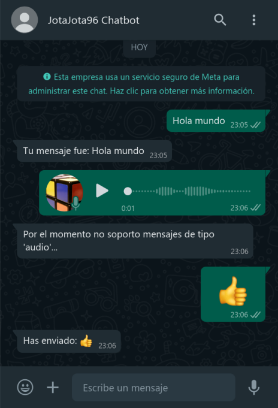

# Prototipo de Chatbot para WhatsApp con API oficial

Este proyecto es una prueba para aprender cómo crear un chatbot para WhatsApp utilizando la API oficial de Meta. Está desarrollado en Java 17 con Spring Boot 3.2 y permite realizar algunas acciones básicas.

**Objetivos específicos:**

- [X] **Enviar Templates:** Enviar mensajes predefinidos utilizando plantillas.
- [X] **Enviar Mensajes de Texto:** Enviar un mensaje personalizado a un usuario que haya iniciado la conversación previamente.
- [X] **Configurar el Webhook:** Establecer una conexión para recibir las notificaciones de eventos y mensajes.
- [X] **Recibir Mensajes:** Identificar el tipo de mensaje recibido y acceder a su contenido si es de texto.
- [X] **Responder Mensajes de Texto:** Responder a un mensaje de texto incluyendo el contenido del mensaje recibido.
- [ ] **Solicitar datos uno a uno:** Solicitar una serie de datos a un usuario y mostrarlos en un mensaje al finalizar.

## Captura de pantalla



## Instrucciones

A continuación se detallan los pasos para ejecutar la aplicación en un entorno local.

> **Importante:** Se asume que:
>
> - Ya se ha creado la aplicación en [Meta for Developers](https://developers.facebook.com/apps/?show_reminder=true) y se ha generado un token para la misma.
> - Se ha creado un dominio estático en [ngrok](https://ngrok.com/) y se ha configurado en la aplicación de Meta.

1. Clonar el repositorio.

    ```bash
    git clone https://github.com/JotaJota96/whatsapp-bot-prototype.git
    cd whatsapp-bot-prototype/
    ```

2. Copiar el template del archivo de configuración de secretos a la raíz del repositorio como `secrets.properties`.

    ```bash
    cp src/main/resources/secret.properties.template secrets.properties
    ```

   Abrirlo y completar los datos de conexión a la API de Meta. (URL, token de la API y token de verificación para el webhook)

3. Compilar la aplicación.

    Si se tiene instalado Maven, se puede compilar con:

    ```bash
    mvn clean package
    ```

    De lo contrario, se puede compilar con Docker (aunque al tener que descargar las dependencias, es más lento):

    ```bash
    docker run \
        --rm \
        -v "$PWD":/usr/src/app \
        -v "$PWD"/.m2:/root/.m2 \
        -w /usr/src/app \
        maven:3.6.3-openjdk-17 \
        bash -c "mvn clean package && chown -R $(id -u):$(id -g) target .m2"
    ```

4. Correr la aplicación.

    Si se tiene instalado el JDK de Java 17, se puede correr con:

    ```bash
    java -jar target/WhatsAppBotPrototype-0.0.1-SNAPSHOT.jar
    ```

    Si no, se puede correr con Docker:

    ```bash
    docker run \
        --rm \
        --name whatsapp-bot-app \
        -p 8080:8080 \
        -v "$PWD:/usr/src/app" \
        -w /usr/src/app \
        openjdk:17-alpine \
        java -jar target/WhatsAppBotPrototype-0.0.1-SNAPSHOT.jar
    ```

5. Exponer la aplicación a Internet utilizando [ngrok](https://ngrok.com/) en docker.

    ```bash
    docker run -it \
        --rm \
        --name whatsapp-bot-ngrok \
        -e NGROK_AUTHTOKEN=<TOKEN> \
        --link whatsapp-bot-app \
        ngrok/ngrok \
        http whatsapp-bot-app:8080 \
        --domain=<DOMINIO>
    ```
